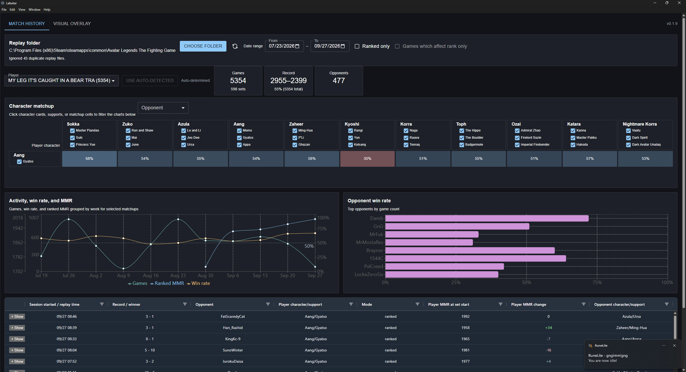

# Labatar

Labatar is an unofficial Windows companion app for reviewing Avatar Legends: The Fighting Game replay files. It reads replay files for analysis and sharing; it does not modify the game or inject into gameplay.



## Download

Download the latest Windows installer from the [GitHub Releases page](https://github.com/lthanni/labatar/releases/latest).

Run the `.exe` installer and launch Labatar from the Start menu. Windows may show a SmartScreen warning because the installer is not currently code-signed; verify that the installer came from the Labatar GitHub Releases page before continuing.

## Match history

1. Launch Labatar.
2. Choose your replay folder. Labatar starts with the usual Steam installation folder when it exists:
   `C:\Program Files (x86)\Steam\steamapps\common\Avatar Legends The Fighting Game`
3. Select the player.
4. Use the matchup cards, support checkboxes, opponent filter, and date range to filter the analysis and replay table.

The app scans `.dlr` files recursively, ignores duplicate file contents, and supports right-click actions for opening a replay or set in File Explorer and exporting replays as a ZIP.

## Updates

Installed releases check GitHub Releases for updates when the app starts. You can also use **Help > Check for Updates...** in the native application menu. When an update is available, Labatar offers native Windows prompts to download and install it.

Updates are available for installed Windows builds. Development runs and unpacked test builds do not use the updater.

## For contributors

Requirements:

- Windows
- Node.js 22 or newer
- pnpm 12.3.4

Install dependencies and start the development app:

```powershell
pnpm install
pnpm run electron:dev
```

Run checks and build the production assets:

```powershell
pnpm exec vp check --fix
pnpm run build
pnpm run electron:build
```

The production build disables the visual overlay and packages a Windows NSIS installer in `release/`.

## Publishing a release

The version in `package.json` must match the tag being pushed. Stable releases use normal semantic versions, while beta builds use a semantic-version prerelease suffix such as `0.2.2-dev.0`.

For a beta release:

```powershell
# package.json: "version": "0.2.2-dev.0"
git add package.json
git commit -m "release: 0.2.2-dev.0"
git tag v0.2.2-dev.0
git push origin master --tags
```

For the stable release after beta testing:

```powershell
# package.json: "version": "0.2.2"
git add package.json
git commit -m "release: 0.2.2"
git tag v0.2.2
git push origin master --tags
```

Tags containing a prerelease suffix are published as GitHub prereleases. Beta installers use their own update channel, so stable installations do not receive beta updates automatically, while beta installations can receive later builds from the same channel. The workflow uploads all YAML update metadata so both stable and beta channels work with `electron-updater`.

## Project status

Labatar is an unofficial community project and is not affiliated with or endorsed by Paramount, Avatar Studios, or the game’s developers.
